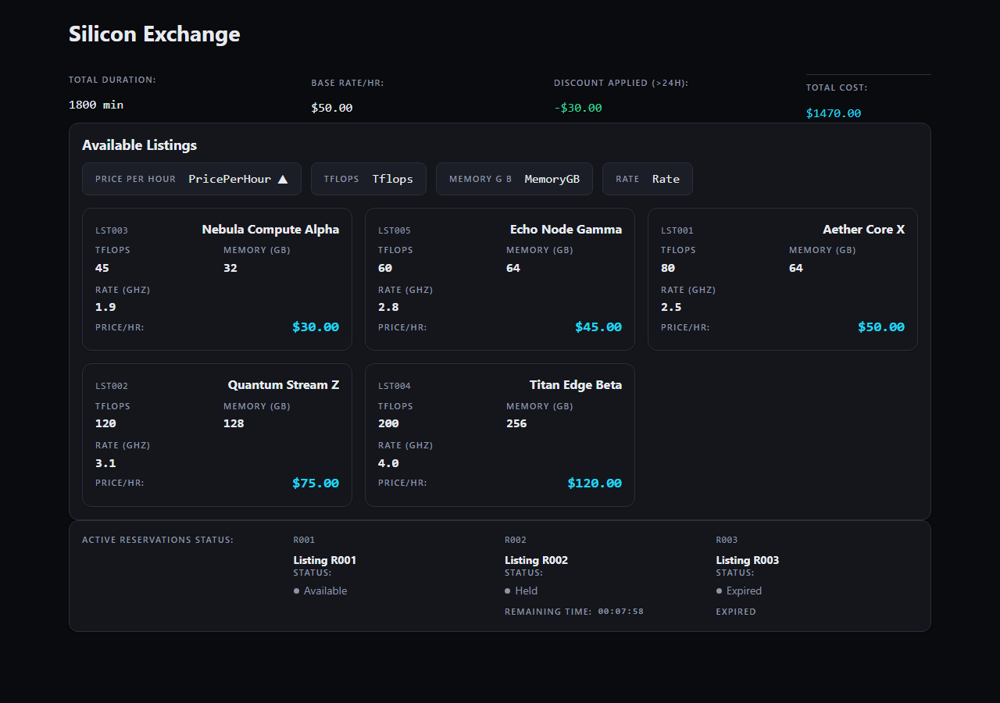

# FAQ — the questions we expect, answered plainly

**"The cloud agent did it in 15 minutes — so what?"**
Yes, it did, and we say so in the comparison table. The claim is not speed. It is that a
fixed-cost laptop, with no code leaving it, produced a fully machine-verified result
unattended. If your constraint is privacy, cost predictability, or air-gapped
infrastructure, the 15-minute cloud run is not an option — the 3h46m local run is.

**"Is this cherry-picked? How many runs?"**
8 full-challenge runs were performed during development, across two quantizations of the
same model. 5 stopped early — every stop was CodeLead's own gates catching a defect
(ours, not the model's, in most cases), and each produced a documented fix. 1 completed
with a single failed increment, repaired afterward under the same governance. 2 completed
17/17: the 4-bit quantization on 2026-09-01, and the published 8-bit run on 2026-09-02 —
which was the first run performed on its final configuration. We did not run the final
configuration repeatedly and pick a winner.

**"The app is simple."**
Fair. It is a front-end product with mock data — that is what the public challenge
specifies. The harder result class is brownfield: the same governance applied to a
17-year-old C# library, where the pipeline discovered and satisfied an undocumented
co-change obligation before its patch was allowed to land. That story is next; this page
is the greenfield one.

**"How much did the harness do versus the model?"**
Exactly this. The project scaffold — an empty runnable shell of the kind a project
template gives you, with its styling baseline and test setup — came from the pipeline,
with no model involvement. Everything that makes this Silicon Exchange rather than an
empty app was written by the model: the data layer, all five business-rule
implementations, every page and component, and all 53 unit tests. The harness planned the
work, scoped each step, ran the gates, reverted what failed, and recorded the evidence. It
never wrote application code, and no human wrote or edited any.

**"Can I reproduce it on my machine?"**
Yes. The prompt, model, quantization, runtime and machine spec are in
[`reproducibility/`](reproducibility/). Any Mac that can serve a 27B at 8-bit (≈28 GB of
weights) is in range; the 4-bit variant of the same model needs about half that and also
completed 17/17 in a development run. The installable beta will add the one-command rerun. If you try it, file
a reproduction report — including the failures; those are the interesting part.

**"Was the model fine-tuned or given the solution?"**
No fine-tuning; the stock published weights were served locally. At the category level,
the model received: the challenge prompt, the increment plan and the current increment's
objective and acceptance criteria, a ledger summary of what already exists (and what
failed), relevant file contents, and — on retries — the machine-generated failure report.
It never received reference solutions, and no human edited its output.

**"Why not just use a frontier model?"**
If you can, and your code may leave the building, a frontier model is faster and stronger
— the video shows exactly that. The point of this result is different: governance makes
small local models viable, and the weaker the model, the more the governance matters. In
our development runs the same pipeline took a 4B model to 4 of 14 increments, a 27B at
4-bit to 17/17, and the 27B at 8-bit to the published clean run. Same gates at every size;
only the model changed.

**"What does a partial run actually produce?"**
A smaller app that works, not a broken one. Running the same challenge on a 4B model
(google/gemma-4-e4b, on a mid-range Windows desktop) verified 4 of 14 increments in 6.2
hours and stopped honestly: the routing, the detail pages, the filters and the test suite
were never built, and the ledger records each of those increments as failed with its
cause. What *did* land is real and runs — the pricing math on screen with its
rounding and over-24-hour discount, a sortable listing grid, and a live hold countdown
that expires:

That is the governance floor doing its job at the small end: every increment that shipped
was machine-verified, every one that didn't is recorded as not built. Nothing was
half-applied and nothing was claimed.

**"What is patented?"**
The underlying methods are the subject of three provisional patent applications. We
describe the mechanism at the level of the six steps above and no further — not the
prompts, protocols, or gate implementations. That is also why the published session
evidence excludes model I/O transcripts; the receipts keep every code commit, the
evidence ledger, and the run summaries.
