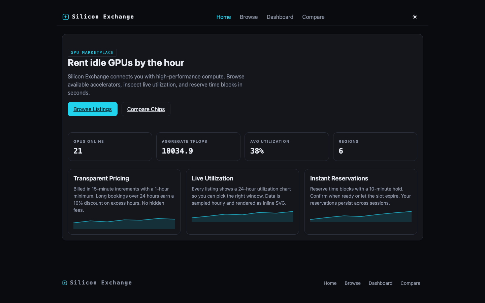
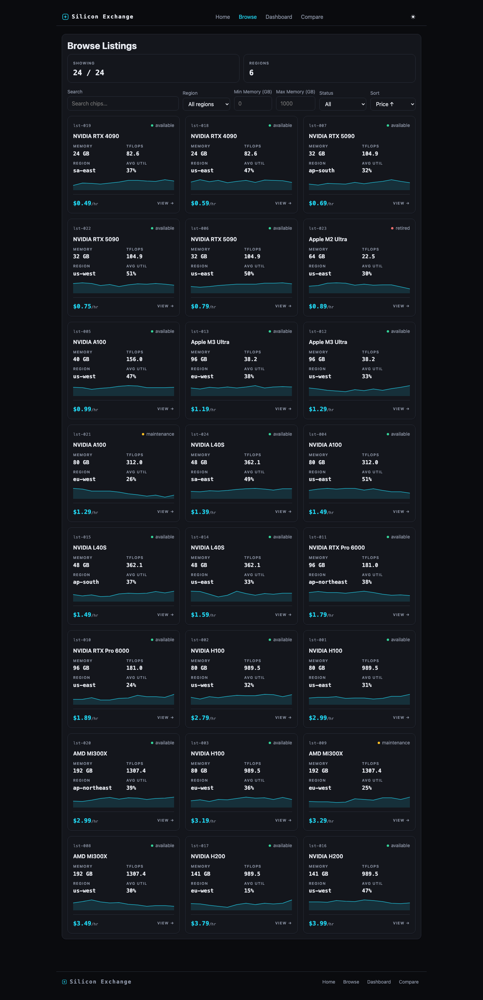
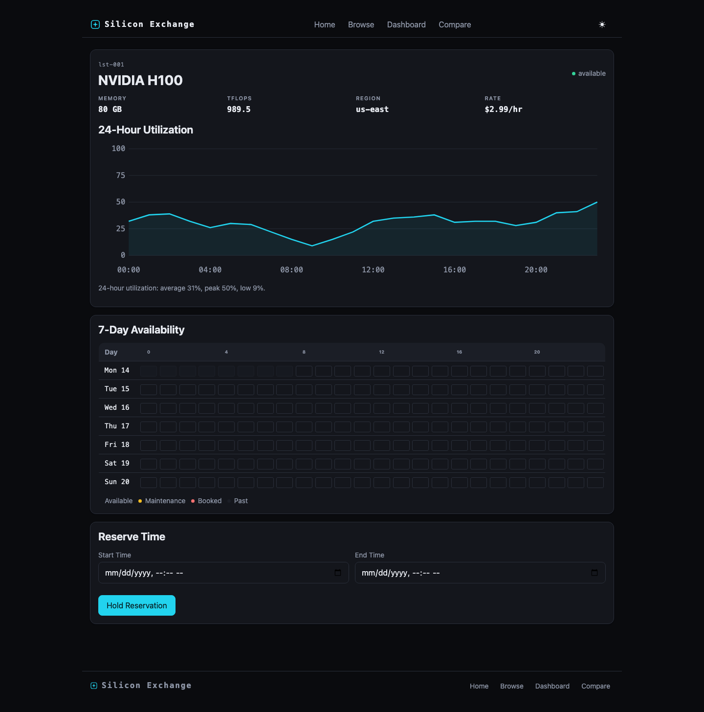
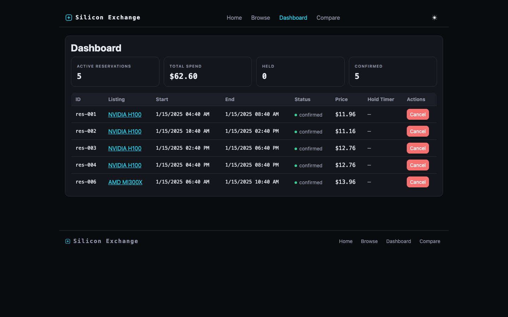

# A 27B model on one Mac built what a 2.8-trillion-parameter model needed four.

Same public challenge prompt. A complete, tested, six-route web product — planned, built,
verified and committed end-to-end by **CodeLead** orchestrating a small local model. No
human touched the code.

**The receipts:** the application, exactly as the pipeline produced it, with full git
history — increment checkpoints, one governed repair pass, and the evidence ledger:
**[CodeLead-ai/silicon-exchange](https://github.com/CodeLead-ai/silicon-exchange)**.
How to reproduce it, step by step: **[reproducibility/](reproducibility/)**.

| | |
|---|---|
| Wall clock, unattended, launch to exit | **3h 45m 48s** (3h 39m 03s build after a 6m 45s planning phase) |
| Increments verified | **17 / 17** — every one gate-checked |
| Unit tests, written by the model, passing | **53 / 53** |
| Provider / transport model errors | **0** — one call was cut by CodeLead's own 15-minute governor and succeeded on retry |

All four values come from [`reproducibility/run-summary.json`](reproducibility/run-summary.json),
which is derived from the run's own logs.

## The challenge

"Silicon Exchange" is a GPU-rental marketplace from a public benchmark prompt featured in
Alex Ziskind's video
[*"I Gave Local AI and the Cloud the Exact Same Job"*](https://www.youtube.com/watch?v=ujs0_cpAnaw):
six routes; five business-rule sets that must be pure, tested functions (half-open overlap
detection, 15-minute round-up pricing with an excess-hours discount, hold expiry,
maintenance blocking, combined filter/sort); URL-persisted filters; localStorage
reservations; a dark "trading terminal" design language; and a quality bar of
`npm install · test · build · dev` all green.

We ran the same functional requirements with one declared change: the stack was adapted
from Next.js to Vite + React + TypeScript (the stack the pipeline currently supports). The
adapted prompt is published verbatim in
[`reproducibility/challenge-prompt.md`](reproducibility/challenge-prompt.md).

## The comparison

| Contender | Model | Hardware | Time | Outcome |
|---|---|---|---|---|
| Kimi K3, local *(from the video)* | 2.8T params (817 GB served) | 4× Mac Studio, 2 TB unified, ≈$64k · 14.7 tok/s | 4 hours | Completed |
| Abacus Supercomputer *(from the video, sponsored)* | Opus 5 high + GPT 5.6 Soul (frontier cloud) | Always-on cloud VM | 15 min | Completed, strongest visuals |
| **CodeLead + local model** | **qwen3.8 27B @ 8-bit** | **One Mac laptop** (LM Studio) | **3h 46m** | **Completed — every claim machine-verified** |

The first two rows are figures as stated in the video. Our model is roughly 100× smaller
than the local reference — and generated faster on one machine (≈18 vs 14.7 tokens/second)
than the 2.8T model did on four.

## What these numbers do and do not claim

- **Not a speed claim.** The cloud agent was faster. The claim is that a fixed-cost laptop,
  with no code leaving it, produced a fully machine-verified result unattended.
- **Run count, honestly:** 8 full-challenge runs were performed during development across
  two quantizations. 5 stopped early — each stop was CodeLead's own gates surfacing a
  defect, and each produced a documented fix. 1 completed with a single failed increment
  (repaired afterward under the same governance). 2 completed 17/17 — the 4-bit
  quantization one day earlier, and the published 8-bit run, which was the first run
  performed on its final configuration.
- **Stack adaptation is declared** (Next.js → Vite), and the adapted prompt is published.
- More anticipated questions, answered plainly: [FAQ.md](FAQ.md).

## How CodeLead built it

Six steps, each recorded in the receipts:

1. **Increment plan.** One planning call decomposed the request into 17 dependency-ordered
   increments — pure-logic rules (with tests) before the pages that consume them.
2. **Coverage gate.** A reviewer checked request → plan coverage and injected acceptance
   criteria for anything the plan missed, before a minute was spent building.
3. **Project scaffold.** The empty runnable shell — the equivalent of a project template,
   with its styling baseline and test setup — is produced by the pipeline itself, with no
   model calls involved.
4. **Per-increment build.** For each increment: preflight analysis → patch proposal →
   safety/compliance check gate → apply. The model never edits files directly.
5. **Machine verification.** Compile gate, full unit-test gate, a headless-browser
   acceptance probe on the increment's own route, and a cumulative regression probe over
   everything built before.
6. **Evidence ledger.** Each verified increment is git-checkpointed with its evidence; the
   ledger of what exists (and what failed) grounds every later step. Failures revert
   cleanly and never poison the build.

The invariant: nothing was marked done that wasn't machine-checked. When a probe couldn't
verify something, it said so, and the increment retried or reverted.

## The result

| | |
|---|---|
|  |  |
| Home — live fleet stats computed from the data layer | Browse — search, filters and sort persisted in the URL |
|  |  |
| Listing detail — spec sheet, utilization chart, availability, live-priced reservation | Dashboard — reservations from localStorage with running spend |

## Reproduce it

- The exact prompt: [`reproducibility/challenge-prompt.md`](reproducibility/challenge-prompt.md)
- Model, quantization, runtime and machine: [`reproducibility/model-and-hardware.md`](reproducibility/model-and-hardware.md)
- The increment-by-increment timeline with gate outcomes and receipt commits:
  [`reproducibility/run-log.sanitized.md`](reproducibility/run-log.sanitized.md)

If you rerun it — on any hardware, with any model — we'd genuinely like to see the result:
[open a reproduction report](../../issues/new?template=reproduction-report.md).

## Why this matters

Frontier-scale results don't require frontier-scale hardware. CodeLead's thesis — that a
governed engineering workflow (planning, scoped execution, machine verification, evidence
records) unlocks small local models — means private, on-premise, fixed-cost AI
engineering: no code leaves the building, no per-token cloud bill, no four-machine
cluster. Three provisional patents are filed on the underlying methods.

## What CodeLead is

CodeLead is a local-first governance layer that turns AI coding agents into a governed
engineering workflow: work is planned, scoped, executed one approved change at a time,
machine-verified, and recorded as evidence. It works with local models via LM Studio (and
OpenAI-compatible servers such as Ollama). An installable beta is coming.

## Get the beta

**[Join the waitlist →](https://tally.so/r/VL6KYE)** — email only; organization and
hardware questions optional. The announcement will also land in
[Discussions](../../discussions).

---

Reference comparison from Alex Ziskind, ["I Gave Local AI and the Cloud the Exact Same
Job"](https://www.youtube.com/watch?v=ujs0_cpAnaw), a video sponsored by Abacus AI; Kimi K3
ran unattended on the 4× Mac Studio cluster (Thunderbolt 5 mesh, MLX distributed), and the
Abacus Supercomputer agent ran with Opus 5 high + GPT 5.6 Soul selected — figures as
stated in the video. CodeLead run: 2026-09-02, qwen3.8-27b (8-bit, MLX) via LM Studio on a
single Mac. Content license: CC BY 4.0. © 2026 Pedro Ramirez · CodeLead.
