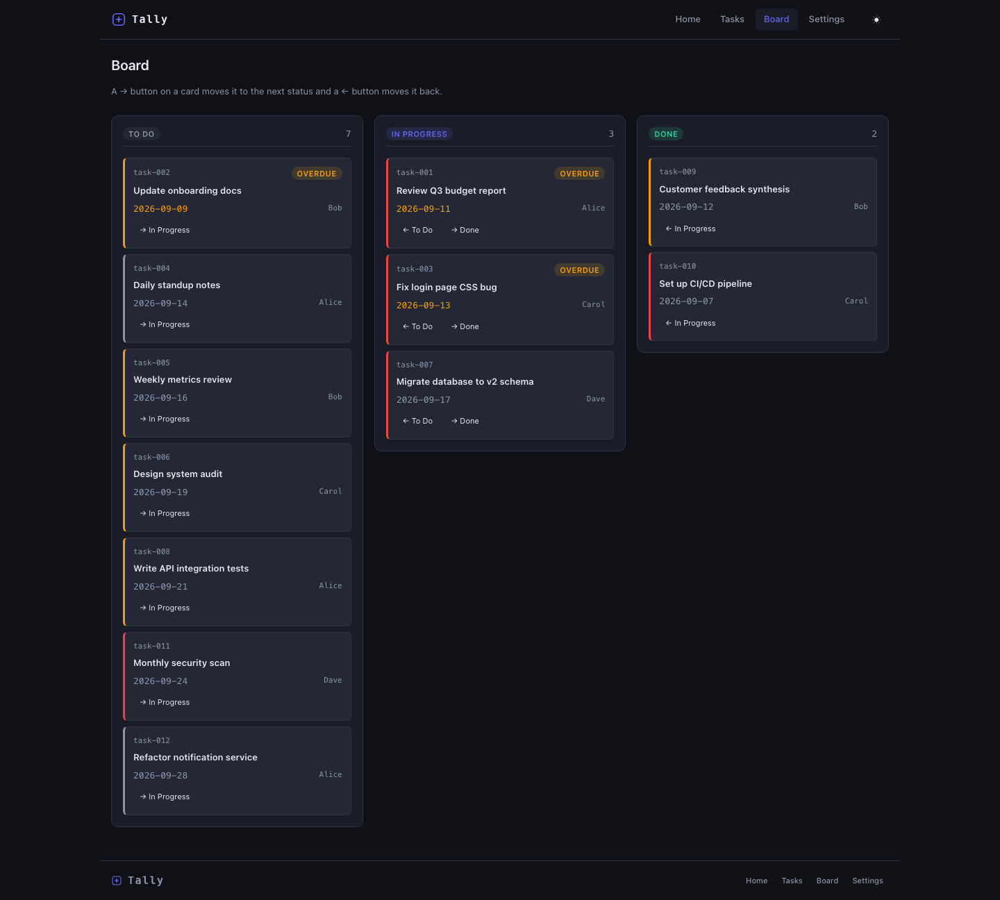
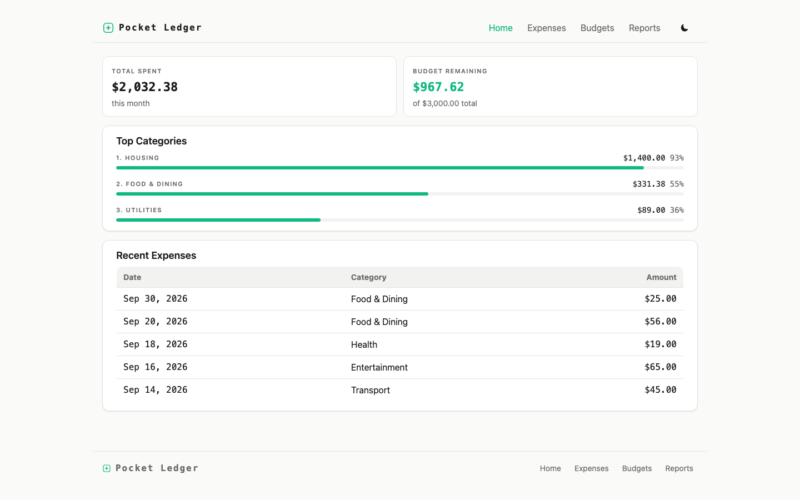

# A 27B model on one Mac built what a 2.8-trillion-parameter model needed four.

Same public challenge prompt. A complete, tested, six-route web product — planned, built,
verified and committed end-to-end by **CodeLead** orchestrating a small local model. No
human touched the code. In under two and a half hours, on a laptop.

**The receipts:** the application, exactly as the pipeline produced it, with full git
history — the shell, the build, one governed fix, the polish:
**[CodeLead-ai/silicon-exchange-app](https://github.com/CodeLead-ai/silicon-exchange-app)**.
How to reproduce it, step by step: **[reproducibility/](reproducibility/)**.

| | |
|---|---|
| Wall clock, unattended, launch to exit | **2h 26m 37s** (2h 09m of build after a 17m 28s planning phase) |
| Increments verified | **18 / 18** — every one gate-checked |
| Unit tests, written by the model, passing | **40 / 40** |
| Business-rule checks, independent of the model's tests | **26 / 26** — including the one its first attempt got wrong |
| Provider / transport model errors | **0** — zero retries, zero warnings |

All values come from [`reproducibility/run-summary.json`](reproducibility/run-summary.json),
derived from the run's own logs.

## The challenge

"Silicon Exchange" is a GPU-rental marketplace from a public benchmark prompt featured in
Alex Ziskind's video
[*"I Gave Local AI and the Cloud the Exact Same Job"*](https://www.youtube.com/watch?v=ujs0_cpAnaw):
six routes; five business-rule sets that must be pure, tested functions (half-open overlap
detection, 15-minute round-up pricing with an excess-hours discount, hold expiry,
maintenance blocking, combined filter/sort); URL-persisted filters; localStorage
reservations; a dark "trading terminal" design language; and a quality bar of
`npm install · test · build · dev` all green.

We ran the same functional requirements with one declared change: the stack was adapted
from Next.js to Vite + React + TypeScript (the stack the pipeline currently supports). The
adapted prompt is published verbatim in
[`reproducibility/challenge-prompt.md`](reproducibility/challenge-prompt.md).

## The comparison

| Contender | Model | Hardware | Time | Outcome |
|---|---|---|---|---|
| Kimi K3, local *(from the video)* | 2.8T params (817 GB served) | 4× Mac Studio, 2 TB unified, ≈$64k · 14.7 tok/s | 4 hours | Completed |
| Abacus Supercomputer *(from the video, sponsored)* | Opus 5 high + GPT 5.6 Soul (frontier cloud) | Always-on cloud VM | 15 min | Completed, strongest visuals |
| **CodeLead + local model** | **qwen3.8 27B @ 8-bit** | **One Mac laptop** (LM Studio) | **2h 27m** | **Completed — every claim machine-verified** |

The first two rows are figures as stated in the video. Our model is roughly 100× smaller
than the local reference — and generated faster on one machine (≈18 vs 14.7 tokens/second)
than the 2.8T model did on four. Our first published run of this challenge, on 2026-09-02,
took 3h 46m; the run above is the current pipeline one week later, same model, same laptop.

## How CodeLead built it

Six steps, each recorded in the receipts:

1. **Increment plan.** One planning call decomposed the request into 18 dependency-ordered
   increments — pure-logic rules (with tests) before the pages that consume them.
2. **Plan review.** Before any building started, the plan was checked against the request,
   so that stated requirements could not be silently dropped; six were added.
3. **Project scaffold.** The empty runnable shell — the equivalent of a project template,
   with its styling baseline and test setup — is produced by the pipeline itself, with no
   model calls involved.
4. **Governed build.** The model builds inside a bounded, monitored workspace — write,
   build, test, fix — and CodeLead judges the result at every boundary. The model never
   edits files without the harness seeing it.
5. **Independent verification.** Every planned capability was exercised in a real browser,
   and every business rule in the request was checked independently of the model's own
   tests. What failed became a scoped fix, verified again.
6. **Evidence ledger.** Each verified stage is git-checkpointed with its evidence; the
   ledger of what exists (and what failed) grounds every later step. Failures revert
   cleanly and never poison the build.

The invariant: nothing was marked done that wasn't machine-checked.

## The result

| | |
|---|---|
|  |  |
| Home — live fleet stats computed from the data layer | Browse — search, filters and sort persisted in the URL |
|  |  |
| Listing detail — spec sheet, utilization chart, availability, live-priced reservation | Dashboard — reservations from localStorage with countdowns and running spend |

## Not tuned to this prompt

A fair worry about any benchmark result is that the tool was shaped around the benchmark.
So, the same morning, we wrote two requests in unrelated domains — about 250 words each,
five business rules each, published verbatim — and ran them through the same pipeline with
nothing changed.

| | |
|---|---|
|  |  |
| **Tally**, a team task manager — 2h 02m, 8 of 8 increments, every rule right: recurrence from the original due date with month-end clamping, priority scoring, overdue detection, AND-combined filters. [Request](reproducibility/tally-request.md) | **Pocket Ledger**, a personal expense ledger — 1h 54m, 7 of 7 increments, every rule right: cent-exact splits with the last share absorbing rounding, the budget boundary, month edges at 23:59, half-up fee rounding. [Request](reproducibility/pocket-ledger-request.md) |

Two apps the pipeline had never seen, 15 of 15 increments verified, every business rule
checked against its request, both reviewed by hand as good-looking. One thing both lacked
was a way to add a new task or expense — and neither request asked for one. The pipeline
built what was asked.

## Other models, same pipeline

We ran ten models, six on the laptop and four remote, and here is what each did. Every
increment that shipped was machine-verified, every one that didn't is recorded as not built,
and every finished app was also reviewed by hand. Details in
[`reproducibility/other-models.md`](reproducibility/other-models.md).

| Model | Size | Where · cost | What happened |
|---|---|---|---|
| Gemma 4B (`google/gemma-4-e4b`) | 4B dense | Windows desktop | 4 of 14 increments in 6.2 hours, then stopped honestly: pricing math, a sortable grid and a live hold countdown on one surface; no routing, no tests. |
| Gemma 31B (`google/gemma-4-31b, QAT`) | 31B dense | One Mac laptop | Installed a CSS framework against the request's explicit rule, which broke later increments; stopped at 2h 49m with 2 of 5 attempted increments verified. |
| Muse 28B (`meta/muse-glimmer, GGUF`) | 28B dense | One Mac laptop | Four runs, each exposing and fixing one pipeline gap (unassigned routes, a missing data set, a review finding parked on the skeleton). Fourth run: every page with real data, 23 of 24 increments in 2h 37m, 34 tests, rules right except one pricing case. Reviewed by hand as average: no reservation flow, no charts anywhere. |
| GLM 4.7 Flash (`zai-org/glm-4.7-flash`) | 30B MoE | One Mac laptop | Raw loop: 0 of 3 attempts produced a file. Governed: 8 of 9 increments in 2h 08m, no tests, no navigation, 5 listings; the rules its functions could take were right. |
| Qwen3.6 35B (`qwen/qwen3.6-35b-a3b, 4-bit`) | 35B MoE, 3B active | One Mac laptop | 4 of 6 slices in 1h 42m; two slices never built because the model spent its whole per-turn thinking budget without writing. Home and browse complete; pricing rounds partial hours up to whole hours. |
| Mistral Small 24B (`mistral-small-3.2-24b, 8-bit`) | 24B dense | One Mac laptop | 3 of 9 slices in 2h 03m; a non-reasoning model that left a page rendering blank. No tests, 30 of 62 static items. |
| DeepSeek V4.1 Flash (`deepseek/deepseek-v4.1-flash`, remote via OpenRouter) | MoE, 8–16B active, total not published | Cloud, $0.93 | 7 of 9 slices in 1h 27m; the browse and listing-detail slices never verified (one on a host error), 26 tests, all 29 business-rule checks right. Reviewed by hand as one of the best-looking apps of the whole series, with the functionality working. |
| Kimi K2.7 Code (`moonshotai/kimi-k2.7-code`, remote via OpenRouter) | MoE, total not published | Cloud, $1.10 | **Complete, every claim verified, 1h 11m.** All 8 slices, 21 tests, every runnable rule check right. Reviewed by hand as very good and on a par with DeepSeek: a better reservation layout, other parts implemented better by DeepSeek. A first run lost two slices to the model's own tool-call syntax, now read by the build loop. |
| GLM 5.3 (`z-ai/glm-5.3`, remote via OpenRouter) | large MoE, total not published | Cloud, $3.29 | **All 11 increments verified in 35 minutes**, 70 tests, 62 of 62 static items, 29 of 29 rule checks right — and reviewed by hand as a bad interface: wrong colours, a single-column browse page, and the reserve flow is not usable. The most complete build and one of the least usable. |
| gpt-oss 120B (`openai/gpt-oss-120b`, remote via OpenRouter) | 117B MoE, 5.1B active | Cloud, $0.08 | 8 of 9 slices in 28 minutes for eight cents; 11 tests, only 5 listings, whole-hour pricing (3 rule checks wrong). Reviewed by hand as the weakest of the batch; its one flourish was emojis on the home page. |
| **Qwen3.8 27B** (`qwen/qwen3.8-27b`, 8-bit) | 27B dense | One Mac laptop | **Complete, every claim verified, 2h 27m** — the run this page is about. |

**Size, cost and result did not line up.** The two remote models that completed the whole
product were not the two that produced the best apps: GLM 5.3 verified everything and was the
worst to use; DeepSeek and Kimi, at a dollar a run, produced the best-looking apps of the entire
series alongside the 27B on the laptop. gpt-oss did the most per cent and the least per app.
Among local models, size alone predicted little: a 28B dense model got closer than a 35B
mixture-of-experts with 3B active, and a 24B non-reasoning model produced a blank page. What
separated the runs was whether the model could plan the whole request, hold a bounded task, and
produce integer arithmetic — and the pipeline caught what each one missed. Remote rows ran on
cloud hosts at three to five times the laptop's token rate, so their wall clocks are not
comparable to the local ones; their costs are the provider's own accounting. The Gemma runs were
made on earlier versions of the pipeline and are reported as run.

## What these numbers do and do not claim

- **Not a speed claim against the cloud.** The cloud agent was faster. The claim is that a
  fixed-cost laptop, with no code leaving it, produced a fully machine-verified result
  unattended.
- **Run count, honestly.** The first published run (3h 46m, 17/17) was made on 2026-09-02.
  In the following week we ran the challenge about twenty more times while changing one
  thing at a time in the pipeline, scoring every run the same way. The run shown here is
  the first performed on the current configuration, not the best of many.
- **One declared adaptation.** Next.js → Vite + React + TypeScript; the adapted prompt is
  published.
- **Interface quality is a human judgment**, not a metric. Ours was reviewed by hand; the
  cloud result in the video is stronger visually, and we say so.
- **Raw is disclosed as run.** The plain loop and opencode did real work only at low
  reasoning effort; at medium they produced nothing. Both configurations, and the plain
  loop's prompt, are in [`reproducibility/control-arms.md`](reproducibility/control-arms.md).
- More anticipated questions, answered plainly: [FAQ.md](FAQ.md).

## Why did Kimi K3 take four hours?

Our reading of the video, not a measurement of their machines. The numbers stated on camera
are 238 tokens/second of prompt processing and 14.7 tokens/second of generation, across four
Mac Studios joined by tensor parallelism — every layer of every token synchronised over the
Thunderbolt mesh. At 14.7 tokens/second, four hours is at most about 210,000 generated tokens.

Two things spend those tokens. The local run used opencode, an open-ended agent loop: the
model is handed the whole prompt and a set of tools, and before every tool call the entire
growing conversation is sent back to it, so every step pays prompt processing again. And
Kimi K3 is a reasoning model, so it thinks at length before each action. Neither is a flaw;
it is what an unstructured loop costs on a very large model, and the video is honest that
the result at the end is good.

CodeLead spends the model differently. Every call is one bounded job with the context it
needs, so a small model has less to deliberate about per step; verification is done by the
harness in the browser and in the test runner, not by asking the model to think harder; and
what the model gets wrong is found and sent back as a scoped fix rather than re-reasoned
from scratch. That is how a 27B on one laptop ends up faster than a 2.8T on four.

## Why not just run the model raw?

The obvious question about any orchestration layer is how much of the result is the model.
So we ran the same model, same prompt, same laptop, same inference settings, with CodeLead
removed — twice, with two different tools. Details in
[`reproducibility/control-arms.md`](reproducibility/control-arms.md).

**What "raw" means.** The stock 27B model, the public one-command Vite scaffold, and a
minimal agent loop: read a file, write a file, run a command, in a cycle until the model
says it is done. No plan, no gates, no verification other than whatever the model chooses
to run. It is the category the video's local setup belongs to, and we ran two members of
it: **opencode**, the tool used in the video, and our own **plain loop**, whose prompt is
published line by line.

**What the plain loop produced.** A complete marketplace in 75 minutes — six routes, 64
passing tests, build green, genuinely good-looking. And the pricing rule wrong: a booking a
few minutes past 24 hours is discounted as if a whole extra hour were used. *Its own test
asserts the wrong number.* Every build, test and render check passed, and the run declared
itself finished.

**What opencode produced, same model, same laptop.** At the reasoning effort we use for
planning: nothing. Two of its three steps ended on the output cap — the model thought past
44,000 tokens without a single tool call — and it exited after 45 minutes with zero files;
raising the cap to 110,000 tokens changed nothing. At low effort it got further: 19 files,
the business rules and 40 passing tests, no pages; at 107 minutes the client's streaming
connection timed out and the run ended. The loop shape that takes a 2.8T model four hours
does not finish on a 27B.

**So why not raw?** Because "finished" is the model's word for it. When code and tests come
from the same misunderstanding, tests passing proves nothing, and nothing in the loop can
tell you. In CodeLead, finished means checked: every business rule in the request is
verified independently of the model's own tests, in the browser and in the test runner. In
the run above, that check caught the same pricing defect in CodeLead's own build, scheduled
a scoped fix, and confirmed it — ten minutes, nobody reading the code. That difference, not
speed and not looks, is the case study.

## Why this matters

The video's question was whether local AI can do the job. Its answer was yes, with four
machines, four hours, and a model you cannot buy the hardware for; or the cloud, in fifteen
minutes, with your code leaving the building. Ours is a third answer: **one laptop, a model
that fits on it, under two and a half hours — and every claim about the result checked by a
machine, not by the model that made it.** Frontier-scale results don't require
frontier-scale hardware, and "it compiles and the tests pass" is not the same as "it charges
the right amount". CodeLead's thesis — that a governed engineering workflow (planning,
scoped execution, machine verification, evidence records) unlocks small local models —
means private, on-premise, fixed-cost AI engineering: no code leaves the building, no
per-token cloud bill, no four-machine cluster. Three provisional patents are filed on the
underlying methods.

## Reproduce it

- The exact prompt: [`reproducibility/challenge-prompt.md`](reproducibility/challenge-prompt.md)
- Model, quantization, runtime and machine: [`reproducibility/model-and-hardware.md`](reproducibility/model-and-hardware.md)
- The stage-by-stage timeline with gate outcomes and receipt commits:
  [`reproducibility/run-log.sanitized.md`](reproducibility/run-log.sanitized.md)
- The first published run (2026-09-02, 3h 46m, 17/17, 53/53 tests) and its receipts:
  [`reproducibility/run-2026-09-02.md`](reproducibility/run-2026-09-02.md) and
  [CodeLead-ai/silicon-exchange](https://github.com/CodeLead-ai/silicon-exchange).

If you rerun it — on any hardware, with any model — we'd genuinely like to see the result:
[open a reproduction report](../../issues/new?template=reproduction-report.md).

## What CodeLead is

CodeLead is a local-first governance layer that turns AI coding agents into a governed
engineering workflow: work is planned, scoped, executed one approved change at a time,
machine-verified, and recorded as evidence. It runs local models by default via LM Studio
(and OpenAI-compatible servers such as Ollama); remote models are available when you
choose them, and then the code goes to that provider. An installable beta is coming.
The full write-up of this case study, with the limits spelled out, is at
[codelead.dev/case-study](https://codelead.dev/case-study).

## Get the beta

**[Request early access →](https://codelead.dev/product#early-access)** — email only;
organization and hardware questions optional. The announcement will also land in
[Discussions](../../discussions).

---

Reference comparison from Alex Ziskind, ["I Gave Local AI and the Cloud the Exact Same
Job"](https://www.youtube.com/watch?v=ujs0_cpAnaw), a video sponsored by Abacus AI; Kimi K3
ran unattended on the 4× Mac Studio cluster (Thunderbolt 5 mesh, MLX distributed) driven by
opencode, and the Abacus Supercomputer agent ran with Opus 5 high + GPT 5.6 Soul selected —
figures as stated in the video. CodeLead run: 2026-09-14, qwen3.8-27b (8-bit, MLX) via LM
Studio on a single Mac laptop. Content license: CC BY 4.0. © 2026 CodeLead.
