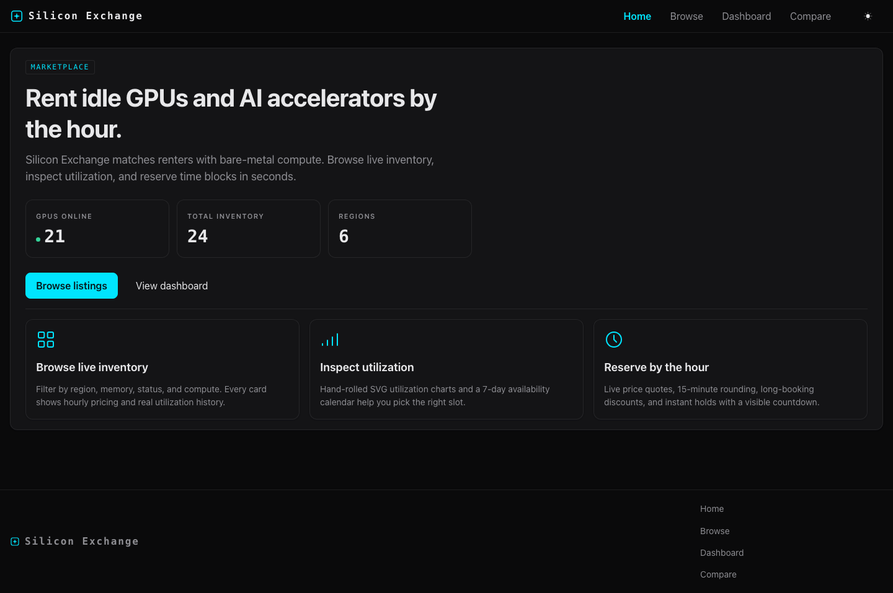
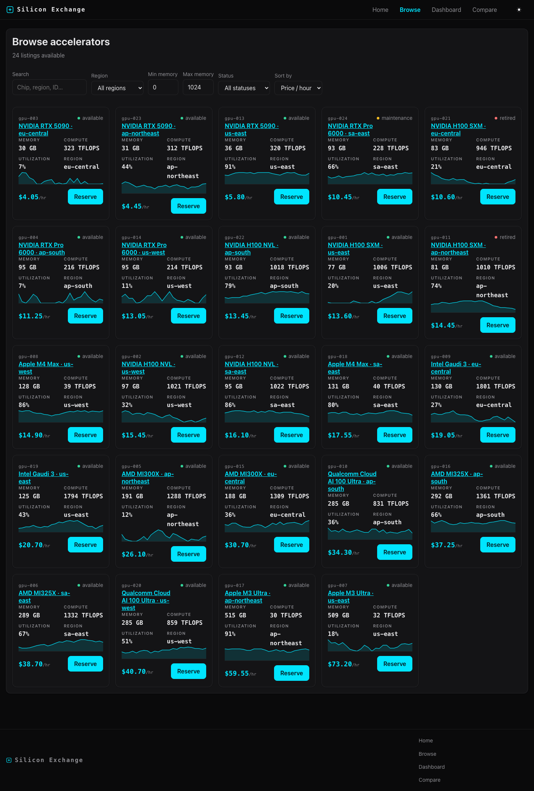
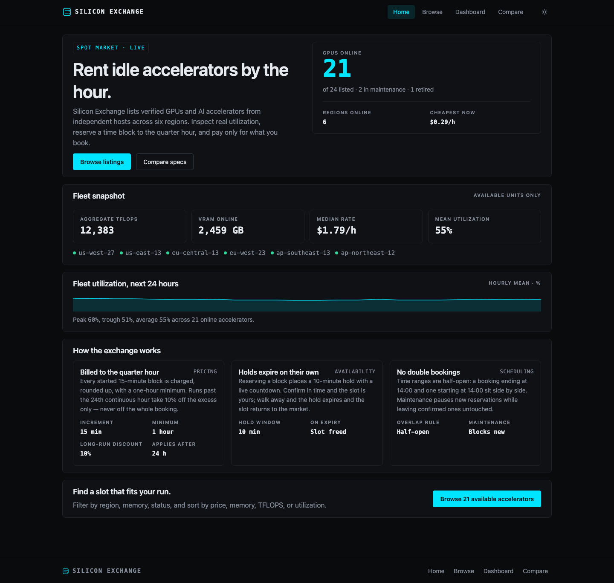
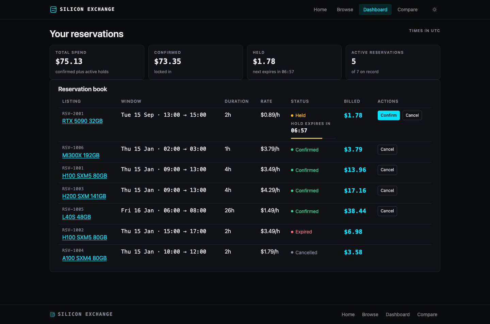
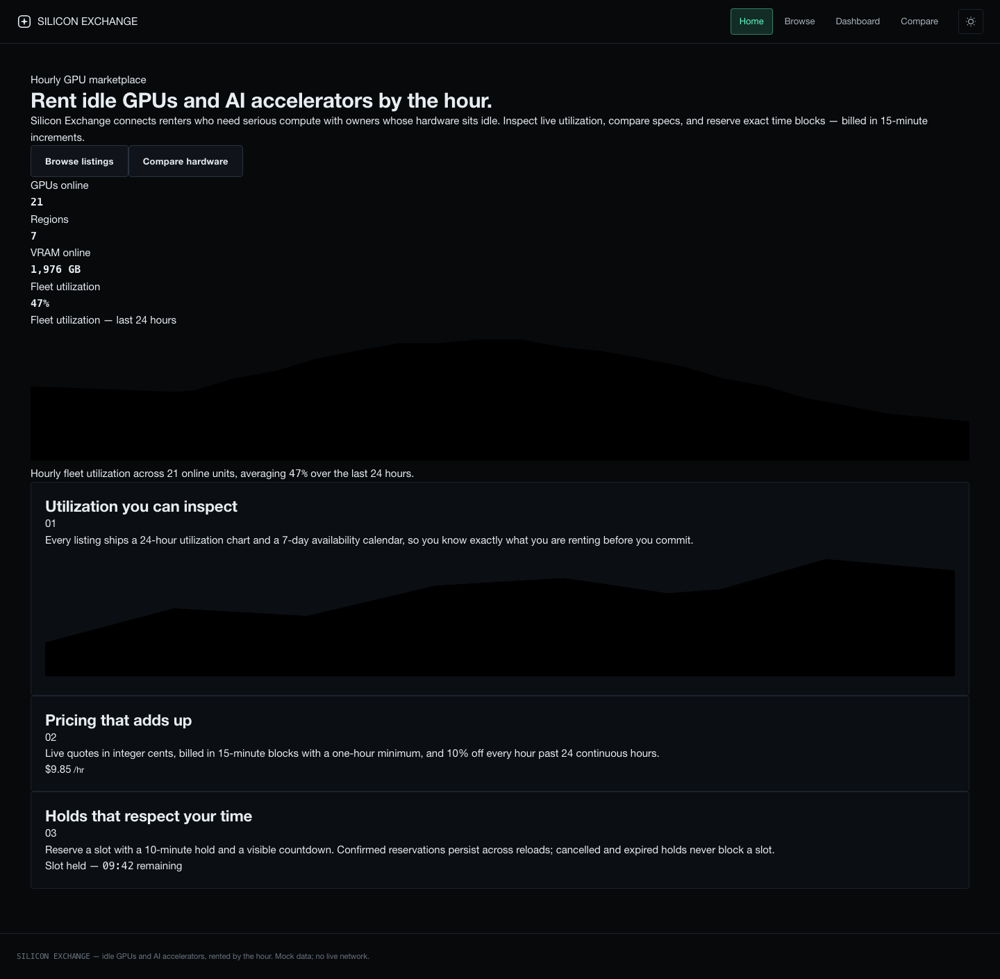
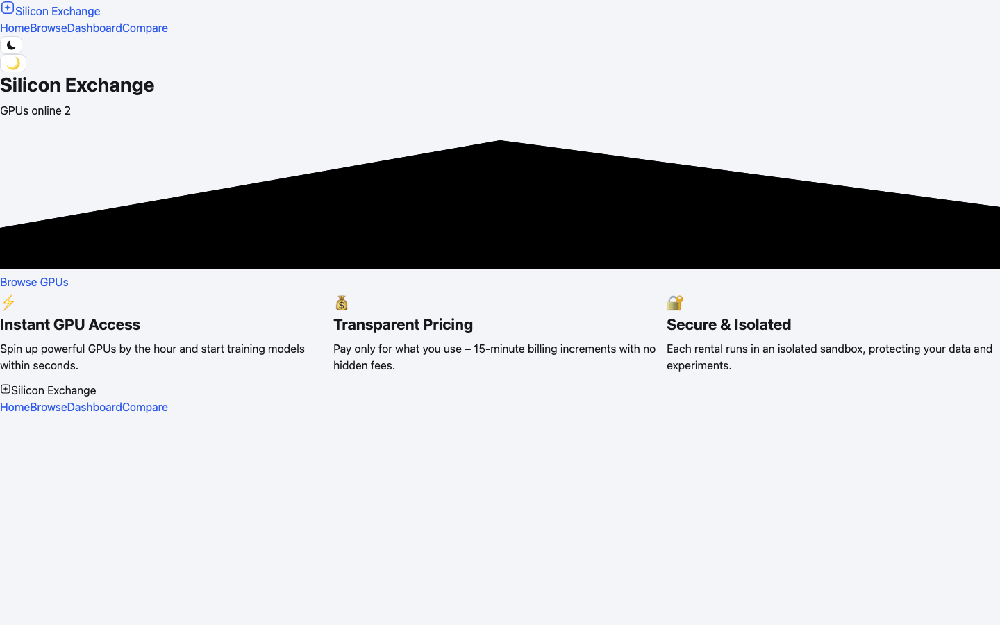
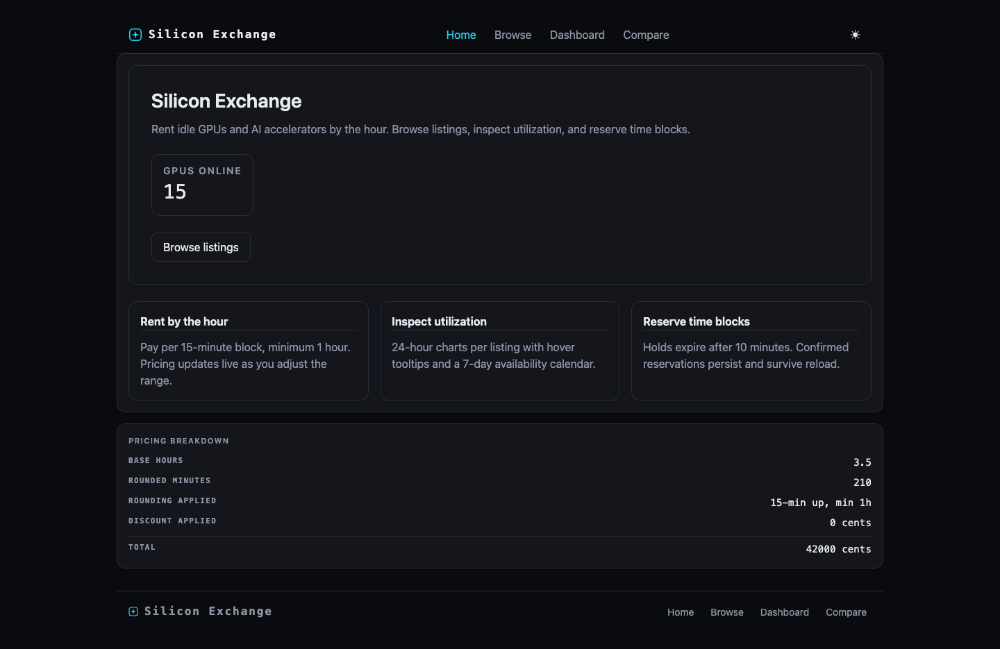
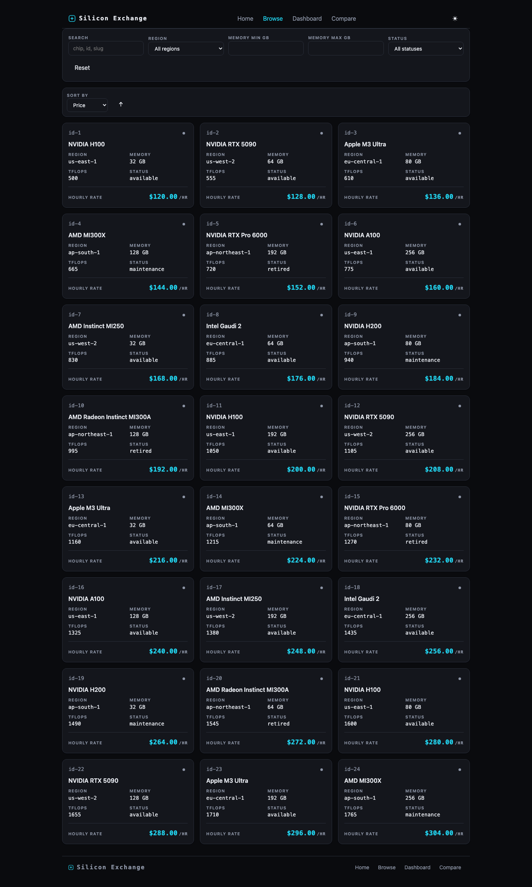
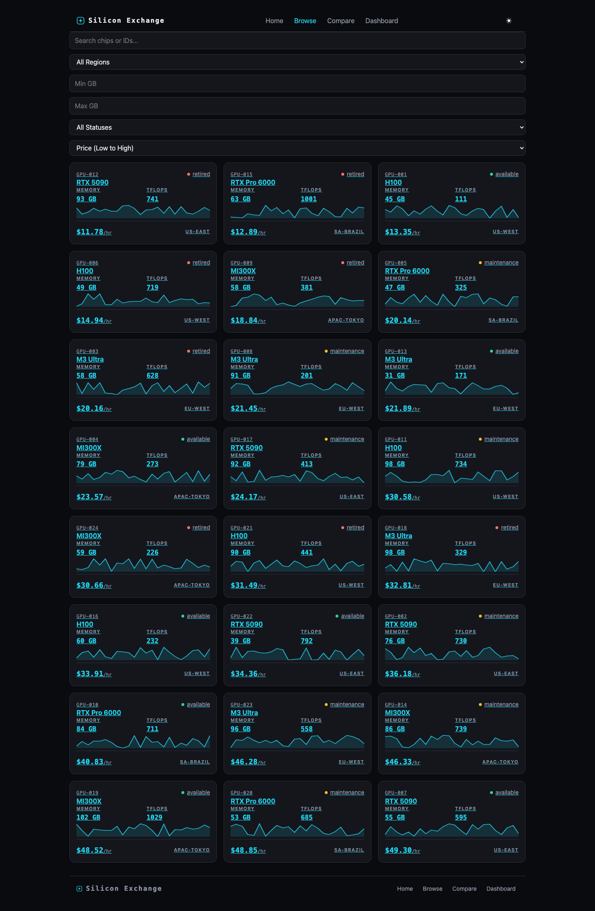
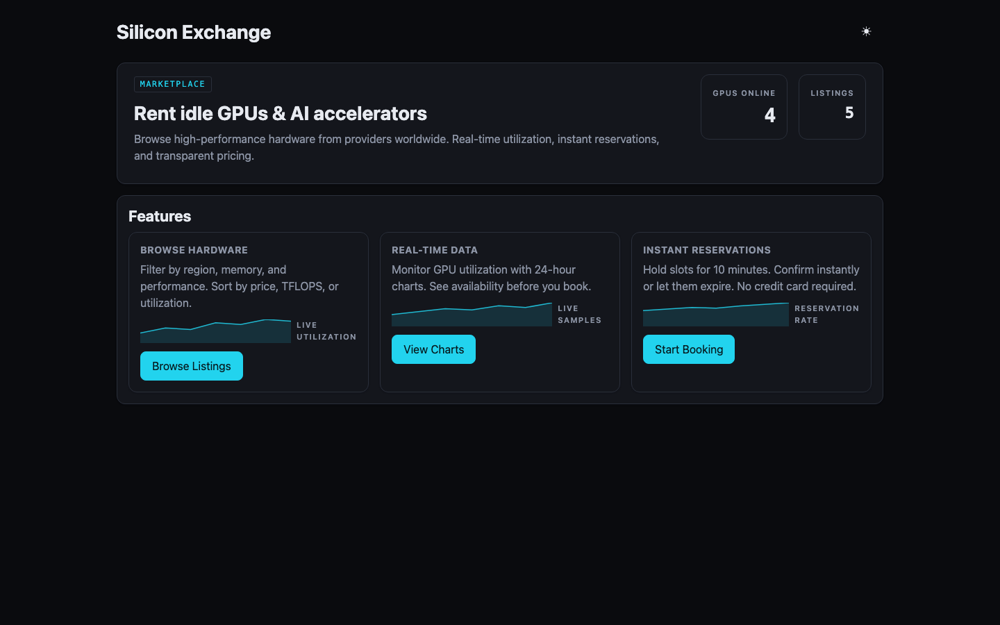

# Other local models on the same challenge

Same prompt, same pipeline family, same gates. The Gemma and Muse runs were made during
development on earlier versions of the pipeline and are reported as run, not re-scored; a
"verified" increment means build green, tests green, and everything verified earlier still
rendering.

| Model | Size · format | Where | Result |
|---|---|---|---|
| `google/gemma-4-e4b` | 4B | Windows desktop (mid-range GPU) | **4 of 14** increments in 6h 13m; exit `completed_with_failures:9`. 36 attempts: 20 produced no code change, 12 failed the build, 1 broke an earlier page. Ten model errors, seven of them context-length overflows. No routing, no test files, 5 listings instead of 24. What landed runs: pricing math on screen, a sortable grid, a live hold countdown. |
| `google/gemma-4-31b` (QAT) | 31B | One Mac laptop | Installed Tailwind v4 against the request's explicit "no CSS framework" rule, without the PostCSS configuration it needs, which broke the build for later, unrelated increments. 34 min per increment on a 22-increment plan; **stopped at 2h 49m with 2 of 5** attempted increments verified. |
| `meta/muse-glimmer` | 28B dense · GGUF | One Mac laptop | **13 of 15** increments in 3h 08m (12.5 min per increment); build green; **13 of 13** of its own tests passing; no CSS framework. The two failures: a utilization chart with tooltip that the browser check could not observe, and a pricing engine whose promised unit tests were never written. Interface near-unstyled: 314 lines of CSS across 18 source files. |
| `zai-org/glm-4.7-flash` | 30B MoE | One Mac laptop | Plain loop: **0 of 3** attempts wrote a file; each reasoned past 60,000 tokens without acting. Governed run (2026-09-14, current pipeline): **8 of 9** increments in 2h 08m, exit `completed_with_failures:1`. The data-and-logic slice failed three attempts (the model kept declaring a capability it never wired up) and was recorded as not built; later slices wrote the rule functions themselves. **No unit tests were written** (the request requires them). No navigation between pages, 5 listings instead of 24, 42 of 62 static checklist items, 4 retries, 1 warning, 118 model calls. Hand-written business-rule checks: **21 passed, 0 wrong, 8 not runnable** (filter/sort inline in the page, not a pure function), 1 skipped. Its in-pipeline rule check could not run: the model spent 24,000 reasoning tokens on the rules call without producing output — the same spiral the raw loop showed. |
| `qwen/qwen3.6-35b-a3b` | 35B MoE, 3B active · 4-bit MLX | One Mac laptop | Current pipeline, 2026-09-14: **4 of 6** coarse slices in 1h 42m, exit `completed_with_failures:2`. The listing-detail slice (three attempts) and the home/dashboard/compare content slice (three attempts) never produced a file: each build turn was cut at its 16,000-token thinking budget before the model acted — the deliberation spiral the raw loop showed, now on a 3B-active model at low effort. Home and browse complete (nav, 24 listings, filters, sort), 10 unit tests, 59 of 62 static items. Hand-written business-rule checks: **15 passed, 3 wrong** (pricing rounds 15-minute blocks up to whole hours: 61 min billed as 2 h; the excess-hour discount applied to a whole hour), 8 not runnable (filter/sort inline), 2 skipped. The in-pipeline rule check reported 9 pricing failures on this app. |
| `mistral-small-3.2-24b-instruct` | 24B dense · 8-bit MLX | One Mac laptop | Current pipeline, 2026-09-14/15 (on the tree before the route fix): **3 of 9** slices in 2h 03m, exit `completed_with_failures:6`. A non-reasoning model: 72 build calls with zero thinking tokens, 128 turns, six slices that never produced a verified change; the in-pipeline rule check could not run (its reply was not valid JSON). Build green, **no tests**, 30 of 62 static items, and the home page renders blank at runtime. |
| `moonshotai/kimi-k2.7-code` | MoE, total not published · remote via OpenRouter (Fireworks) | Cloud | **Remote run, disclosed**: the request, plan and code went to the provider. Two runs on the current pipeline, 2026-09-15. First: **4 of 8** slices in 36.7 min, $1.04 — the data-and-rules and shell-and-home slices were lost because the model answered in its native tool-call syntax (`functions.read_file …`), which the build loop treated as no action; its rule functions still passed 26 of 26 hand-written checks. The parser now accepts that syntax. Second run: **8 of 8** slices in **71.2 min**, 60 calls, 1.61M prompt tokens (1.16M cached), 178k completion (71k reasoning), **$1.10**, build green, **21 tests**, 59 of 62 static items, hand-written checks **25 passed, 0 wrong**, 1 not runnable purely (the cancelled-reservation filter reads module-level data), 2 skipped. Throughput ~62 tokens/second against ~12–19 locally. |
| `z-ai/glm-5.3` | large MoE, total not published · remote via OpenRouter | Cloud | **Remote run, disclosed.** Current pipeline, 2026-09-15: **11 of 11** increments in **35.2 min**, exit `all_increments_done`, 76 calls, 2.9M prompt tokens (2.3M cached), 425k completion (14k reasoning), **$3.29**. Build green, **70 tests**, **62 of 62** static items, in-pipeline rule check 34/34, hand-written checks **29 passed, 0 wrong**, 1 skipped. Browse renders as one long column. |
| `deepseek/deepseek-v4.1-flash` | MoE, 8–16B active, total not published · remote via OpenRouter (Alibaba) | Cloud | **Remote run, disclosed.** **7 of 9** slices in 86.9 min, 73 calls, 4.25M prompt tokens (2.57M cached), 501k completion, **$0.93**. The browse slice and the listing-detail slice never verified (the latter's last attempt ended on an upstream host error). Build green, 26 tests, 60 of 62 static items, hand-written checks **29 passed, 0 wrong**, 1 skipped. |
| `openai/gpt-oss-120b` | 117B MoE, 5.1B active · remote via OpenRouter | Cloud | **Remote run, disclosed.** **8 of 9** slices in 28.2 min, 66 calls, **$0.08**. Build green, 11 tests, 54 of 62 static items (5 listings, 3 regions, no seeded PRNG); the in-pipeline rule check could not run (reply not JSON). Hand-written checks: **22 passed, 3 wrong** (pricing rounds 15-minute blocks up to whole hours), 1 not runnable, 2 skipped. |
| `qwen/qwen3.8-27b` | 27B dense · 8-bit MLX | One Mac laptop | **Complete.** 2h 27m, 18/18, 40/40 tests, 26/26 business-rule checks. The run this case study is about. |

The same prompt produced 15-, 17-, 18- and 22-increment plans across these models; the
plan is the model's, the review of it against the request is the pipeline's.

**Muse on the current pipeline (2026-09-14/15): three runs, two pipeline gaps found and fixed.**
The first attempt hit a serving-side incompatibility (the llama.cpp backend rejected the
model's replies to the governed build step) and was stopped; the runs below use the text-edit
build path that served this model before, with everything else the same (north star, no
preflight, whole-file, rule check).

- `k3-muse-2026-09-14b`: **19 of 20** increments in 1h 54m, build green, **34 tests**, 53 of 62
  static items, **all 26 hand-written business-rule checks right** — and **one page**: the
  model's 20-increment plan declared none of the request's six routes, so every feature was
  rendered on the home page and each increment verified honestly against that plan. Fix: the
  pipeline now places every route the request names on the increments that render it, and
  rejects a plan that leaves one out.
- `k3-muse-2026-09-14c` (with that fix): **every page built** — home, browse, listing detail,
  dashboard, compare, not-found — plus every control and every rule; **23 of 24** increments
  in 2h 11m, exit `all_increments_done`, build green, **20 tests**, **26 of 26 rule checks
  right**, the in-pipeline check 18 passed / 0 failed. And **no listings**: the 24-increment
  plan left out the mock data set the request specifies, so the store started empty, the home
  counter read 0 and browse said "no listings match". A second, smaller gap: one increment's
  edit to the browse page dropped the grid component another increment had mounted. Fix: the
  pipeline now rejects a plan that builds none of a specified data set; the page-mount
  protection is pending.
- `k3-muse-2026-09-14d` (route placement, the data-set rule, review findings retargeted off the
  skeleton): the plan was rejected once for the missing data set and came back with a "Typed
  mock data set" increment; **every page with real data**, **23 of 24** increments in 2h 37m,
  build green, **34 tests**, 58 of 62 static items. Hand-written checks: **17 passed, 1 wrong**
  (pricing floors the hourly rate to a per-quarter amount, so a 333 c/h rate loses 30 cents on a
  30-hour booking), 8 not runnable (filter/sort lives inside components), 2 skipped. The
  reservation form with live quote failed three attempts and is recorded as not built. Close,
  not a complete product yet.

## Hand review of the finished apps (2026-09-15)

Every app was opened and used, not only scored. The verdicts, as given:

- **DeepSeek V4.1 Flash** — very good interface, one of the best of the whole series; some
  increments red, but the functionality works.
- **Kimi K2.7 Code** — very good as well, on a par with DeepSeek; a better reservation layout,
  other parts implemented better by DeepSeek. A matter of taste between the two.
- **GLM 5.3** — a really bad interface despite the clean scorecard: wrong choice of colours, and
  the reserve functionality is not usable.
- **gpt-oss 120B** — as bad as GLM, the weakest of the batch; its one flourish was emojis on the
  home page.
- **Muse (fourth run)** — average; the reservation flow is missing and there are no charts anywhere.

**Size, cost and result did not line up.** Completing every increment and producing a good app
are different outcomes: GLM 5.3 did the first and not the second; DeepSeek did the second with
two slices unverified. The pipeline's verification is exactly what makes that visible: it records
what was built and checked, and leaves the judgment of the interface to a person, on the record.

## Screenshots

| | |
|---|---|
|  |  |
| Kimi K2.7 Code (remote) — home | Kimi K2.7 Code (remote) — browse |
|  |  |
| DeepSeek V4.1 Flash (remote) — home | DeepSeek V4.1 Flash (remote) — dashboard |
|  |  |
| GLM 5.3 (remote) — home: every gate green, reviewed as the worst to use | gpt-oss 120B (remote) — home |
|  |  |
| Muse 28B, fourth run (laptop) — home, with data at last | Muse 28B, fourth run (laptop) — browse |
|  |  |
| Qwen3.6 35B MoE (laptop) — browse, the part it finished | GLM 4.7 Flash (laptop) — home, the only page that holds up |
